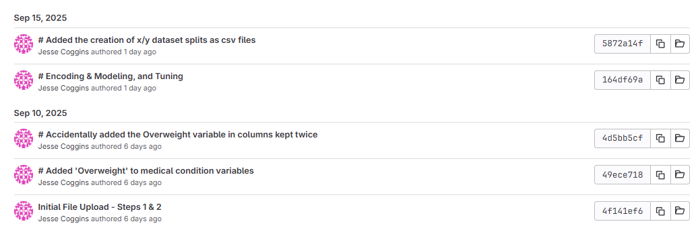
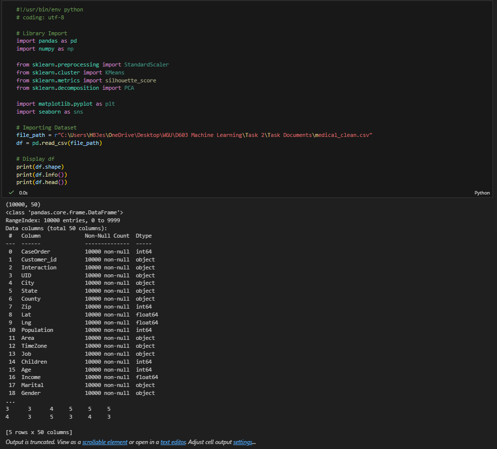

# Hospital Readmission ML

## Overview
This repo combines two machine learning workflows built from the hospital dataset: a supervised classification project and an unsupervised clustering and PCA project. Together, they show breadth across predictive modeling and pattern discovery in healthcare data.

## Coursework Context
This repository packages work originally completed as part of Western Governors University's (WGU) M.S. in Data Analytics program and reorganizes it into a public portfolio format. Screenshots extracted from the original written submissions are preserved in `assets/task1-report-extracts/` and `assets/task2-report-extracts/`.

## What It Shows
- classification modeling for hospital outcome analysis
- data preparation and encoded feature sets
- clustering workflow for segmentation
- PCA-based dimensionality reduction and visualization

## Included Files
- `notebooks/Task-1.ipynb`
- `notebooks/Task-2.ipynb`
- `data/medical_clean_task1.csv`
- `data/medical_clean_task2.csv`
- `requirements.txt`

## Selected Visuals

